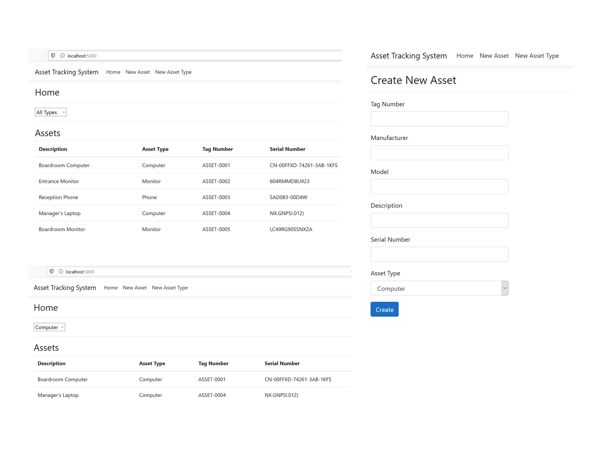

### Background Information
A company has approached you to develop a web-based asset tracking application. They are currently tracking assets in a spreadsheet but as the company has grown so has the need for a web-based tool to help them track their fixed assets.
The assets that are currently being tracked include desktop computers, computer monitors, and phones.
One of the requirements is seeing a page listing all asset types in the system as well a page viewing all assets that can be filtered by asset type is the scope for this project.
### Overview
A multi-layered solution is developed using MVC Core and Entity Framework Core in a code-first approach.
### Screenshots
